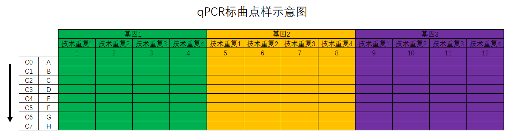
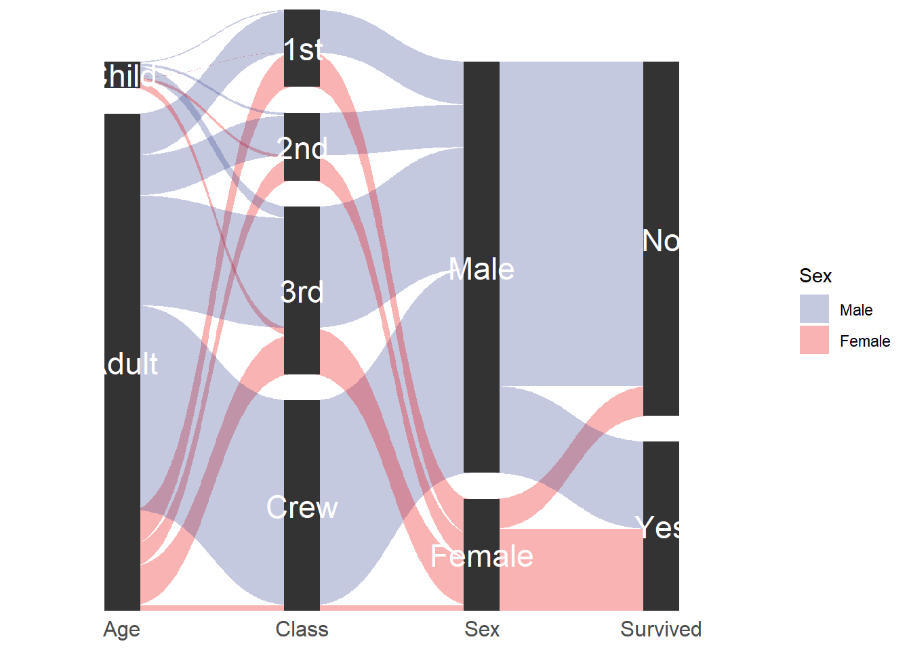

# R语言知识汇总 {#r}


## 本章前言

本章主要是关于R语言的相关知识，包括R语言基础知识、数据统计分析、数据可视化及机器学习等内容。


## R包pac4xiang的使用  {#pac4xiang}

`pac4xiang`这个R包是我自己开发的，包含了一些我自己常用的函数。包目前在[GitHub](https://github.com/lixiang117423/pac4xiang)上，更多功能还在完善中，待进一步开发。

### 安装

在R中运行下面的代码安装`pac4xiang`。

```r
devtools::install_github('https://github.com/lixiang117423/pac4xiang')
```
### 使用方法

#### `calStandCurve`
该函数用与计算相对定量qPCR的标曲。qPCR标曲点样参照图\@ref(fig:qPCR1)。按照我的思路和习惯，我会准备8个浓度梯度的cDNA,从高到低分别是C0到C8。C0是对应批次下多有样品cDNA的组合，然后再以一定的稀释倍数稀释得到C1，C1再以同样的倍数稀释得到C2，依此类推，直到得到C8。

<div class="figure" style="text-align: center">

<p class="caption">(\#fig:qPCR1)qPCR标曲点样示意图</p>
</div>
函数具体怎么用呢？参考下方的代码：


```r
df.1 <- calStandCurve(
  data = "20210927下机数据/20210928lx_1.txt", # 下机数据位置
  genes = c("OsPOX223", "OsAPX1", "OsAPX2", "OsPAL"),# 基因名称,与点样表顺序对应
  rep = 3, # 技术重复的数量
  dilution = 4, # 稀释倍数
  start = 2, # 从第几行开始计算
  end = 6, # 到第几行终止计算
  drop.NA = TRUE, # 是否剔除空值
  fig.type = "pdf" # 保存的图片的文件格式
)
```
其中基因的数量和技术重复的数量乘起来必须是12；基因的顺序必须是从左到右的；输入稀释倍数后告诉程序后续的标曲建立如何取相应的对数；`start`表示从第几行开始计算，如`start = 2`表示的是从B行开始计算标曲；对应的`end = 6`表示的是到第6行，也就是F行结束，也就意味着第一行和最后两行其实是不用的。默认是保存标曲的图片的，如果不需要保存图片加上`save.fig = FALSE`即可，默认的图片格式是`pdf`格式，可以自定义。

<div class="figure" style="text-align: center">

<p class="caption">(\#fig:qPCR2)函数calStandCurve返回的数据框</p>
</div>
返回的结果是个数据框（参考图\@ref(fig:qPCR2)），包含了基因名称、标曲公式、斜率、截距、R$^2$、P值、该标曲适用的自变量范围（最大值和最小值）及计算标曲的日期等。保存的图片默认存在当前工作目录下（运行`getcwd()`查看当前R语言工作目录）。

#### `calRTqPCR`
该函数在`calStandCurve`函数返回的标曲结果的基础上可以计算不同处理下各基因的表达情况。样品的点样方法参考图\@ref(fig:qPCR3)。

<div class="figure" style="text-align: center">

<p class="caption">(\#fig:qPCR3)qPCR标曲点样示意图</p>
</div>
计算表达量的代码如下：

```r
exp.1 <- calRTqPCR(
  data = "20210927下机数据/20210929lx_1.txt",# 下机数据位置
  StandCurve = df.1,#标曲对应的数据框，上一步的输出结果
  genes = c("OsPOX223", "OsAPX1", "OsAPX2", "OsPAL"),# 基因名称,与点样表顺序对应
  treatment = c("CK", "Inter", "Infect") # 三个不同的处理分别是什么
)
```

  其中的`data`就的样品的下机导出数据，`StandCurve`是函数`calStandCurve`返回的数据框，`gene`需要严格控制大小写，必须和输入函数`calStandCurve`的基因名称一样，`treatment`是指定从左到右的处理分别是什么，这个是为了后续方便进行*`t`*检验。

#### `getAlignResults`
该函数可以将软件`CLUSTALW`的输出文件变成`.fasta`格式的比对结果。
写这个函数的原因在于每次我用MEGA进行序列比对构建进化树的时候都报错，不是字符串有问题就是长度不对，索性直接用Linux系统下的`CLUSTALW`进行序列比对，然后用MEGA构建进化树，百试不爽！


```r
my.aln = getAlignResults(aln = 'test.aln')
```
  运行完成后会在当前目录下生成一个`YourAlignResults.fasta`文件，就是`fasta`格式的比对文件，然后就可以用来构建进化树了。
- `mult.aov`
  该函数用于多分组数据进行方差分析。

- `multGroupTtest`
  该函数用于进行多分组的`t`检验。
  这个函数是用于进行多组`t`检验的。比如每次跑qPCR，会有多个处理多个目的基因，这个时候就需要关注每个目的基因在不同的处理中的表达量。用法参考下方代码：

```r
t.test <- multGroupTtest(
  data = exp.all.final, # 输入矩阵
  group1 = "Gene", # 第一个分组名称
  group2 = "Treatment", # 第二个分组名称
  CK = "CK", # 指定CK是叫什么
  value = "Expression", # 指定用于比较的数值在哪一列
  level = 0.95 # 指定检验水平
)
```

#### `plot96well`
该函数用于可视化`Roche`96孔板的`Cq`值。


```r
plot96well(data = "20210927下机数据/20210928lx_1.txt")
```

#### `plotCisElement`
该函数用与可视化基因启动子上的顺式作用元件。需要输入的参数有三个：

#### `data`：`plantCARE`返回的文件；

#### `length`：启动子长度；

#### `Cis`：需要展示哪些顺式作用元件。

#### `plotGeneStructure`
该函数用于可视化基因结构。输入文件为`.gtf`文件。
如果同时输入对应的进化树文件，那么就会按照进化树的顺序对基因名称进行排序，可以和`ggtree`进行联用。

#### `fasta2df`
这个函数主要是为了将`fasta`格式转换成R中常见的`data.frame`格式。使用很简单，输入`fasta`格式即可。

#### `df2fasta`
这个函数主要是将`data.frame`格式的序列文件转换成`fasta`格式。

## R包ggmotif的使用方法 {#ggmotif}

激发我开发这个R包的原因是在许做基因家族分析中的`motif`分析的时候总是找不到趁手的工具去可视化相关的结果，要么是在线网站，要么是别人开发的工具，网页版工具怕哪天就跑路了，别人的工具想要个性化比较困难。那，就自己写一个吧。

R包下载安装：


```r
install.packages("ggmotif")

# 或者
devtools::install_github("lixiang117423/ggmotif")
```

`meme`输出的结果主要是`XML`格式和`txt`格式的文件，需要的结果就在这两个文件里面。

### 从XML文件提取结果并绘图

`motif`在序列上的位置结果存放在`XML`格式的文件中，运行下面的代码便可以将结果转换成数据框格式并进行可视化。


```r
filepath <- system.file("examples", "meme.xml", package="ggmotif")
motif_extract <- getMotifFromXML(XMLfile = filepath)
motif_plot <- motif_location(data = motif_extract)
motif_plot
```

### 从txt文件提取结果并进行可视化

每个`motif`的序列是存放在`txt`文件中的，运行下方的代码便能结果转换成数据框格式并进行绘图。


```r
library(tidyverse)

filepath <- system.file("examples", "meme.txt", package = "ggmotif")
motif_extract <- getMotifFromTxt(data = filepath)

motif_extract %>% 
  dplyr::filter(motif.num == 'Motif.1') %>% 
  dplyr::select(input.seq.motif) %>% 
  ggseqlogo::ggseqlogo() +
  theme_classic()
```

### 与`ggtree`联用

有时候会对序列构建进化树展示进化关系，`ggmotif`中的函数能够以输入的进化树文件为基础，把输出的`motif`在序列上的位置与进化树上的位置进行匹配，便能够与`ggtree`联用在一个图上展示进化树和`motif`在序列上的位置。


```r
filepath <- system.file("examples", "meme.xml", package="ggmotif")
treepath <- system.file("examples", "tree.nwk", package="ggmotif")
motif_extract <- getMotifFromXML(XMLfile = filepath)
motif_plot_with_tree <- motif_with_tree(data = motif_extract, tree = treepath)

p.tree = ape::read.tree(treepath) %>% 
  ggtree::ggtree() +
  ggtree::geom_tiplab()

p.tree  %>% 
  aplot::insert_right(motif_plot_with_tree, width = 0.8)
```


## `ggplot2`绘图相关
### `ggplot2`绘制桑基(冲击图)


```r
library(ggforce)
titanic <- reshape2::melt(Titanic)
# This is how we usually envision data for parallel sets
#head(titanic)
# Reshape for putting the first 4 columns as axes in the plot
titanic <- gather_set_data(titanic, 1:4)
#head(titanic)
# Do the plotting
ggplot(titanic, aes(x, id = id, split = y, value = value)) +
  geom_parallel_sets(aes(fill = Sex), alpha = 0.3, axis.width = 0.1) +
  geom_parallel_sets_axes(axis.width = 0.2) +
  geom_parallel_sets_labels(colour = 'white',angle = 0, size = 6) +
  scale_y_continuous(expand = c(0,0)) +
  scale_fill_aaas() +
  theme_minimal() +
  theme(axis.text.y = element_blank(),
        axis.text.x = element_text(size = 12),
        axis.title = element_blank(),
        panel.background = element_blank(),
        panel.grid = element_blank())
```

<div class="figure" style="text-align: center">

<p class="caption">(\#fig:ggplot4SankeyDiagram)ggplot2绘制桑基图示例</p>
</div>

## 服务器搭建Rshiny-server


```r
#root 权限进入
sudo su
useradd shiny # 添加shiny用户
passwd shiny # 修改shiny用户的密码

chmod +w /etc/sudoers # 修改权限
sudo vim /etc/sudoers # 编辑
# root ALL=(ALL) ALL 该行，在下面添加 shiny ALL=(ALL:ALL) ALL
chmod -w /etc/sudoers # 收回权限

su - shiny # 切换到shiny用户

# 安装R
sudo apt-get update
sudo apt-get install r-base

# 安装shiny包
sudo su -c "R -e \"install.packages('shiny',repos='https://cran.rstudio.com/')\""

# 安装shiny server
sudo apt-get install gdebi-core
wget https://download3.rstudio.org/ubuntu-14.04/x86_64/shiny-server-1.5.17.973-amd64.deb
sudo gdebi shiny-server-1.5.17.973-amd64.deb
```

安装shiny-server的时候参考官方最新的指导页面，[点击访问](https://www.rstudio.com/products/shiny/download-server/ubuntu/)。

日志所在目录为：`/var/log/shiny-server`。需要修改配置文件，保证记录运行日志，否则可能找不到报错提示。


```r
vi /etc/shiny-server/shiny-server.conf
preserve_logs true; # 在最上面添加这行
```

软件所在目录为：`/srv/shiny-server`

安装完成后在浏览器输入`IP:3838`就能访问到示例界面了。默认的端口是`3838`端口，需要其他端口的需要自行调整。

基本管理：


```r
## 重启
sudo systemctl restart shiny-server
##查看状态 
sudo systemctl status shiny-server 
##开启 
sudo systemctl start shiny-server 
##停止 
sudo systemctl stop shiny-server 
```


## Ubuntu安装devtools


```r
sudo apt-get install -y libxml2-dev libcurl4-openssl-dev libssl-devv
```

最重要的是上面这一步，剩下的差啥装啥就OK。

安装`proj`这个包：


```r
sudo apt-get install libproj-dev

install.packages("RcppEigen", INSTALL_opts = '--no-lock')
```

## R shiny开发

### CSS学习网站

[CSS菜鸟教程](https://www.runoob.com/css/css-align.html)。

[CSS在Rshiny中的使用](https://unleash-shiny.rinterface.com/beautify-css.html)。

