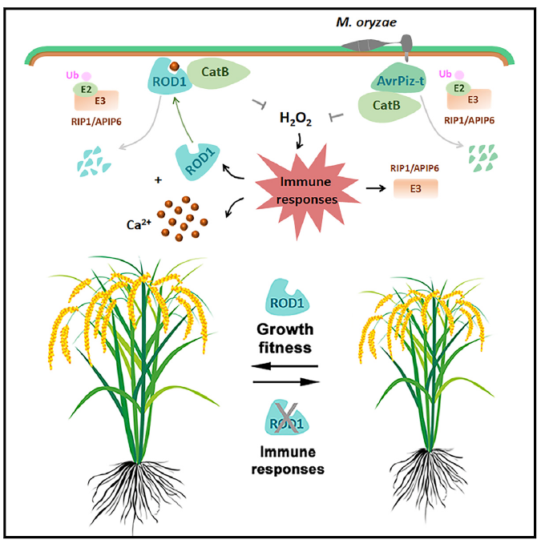
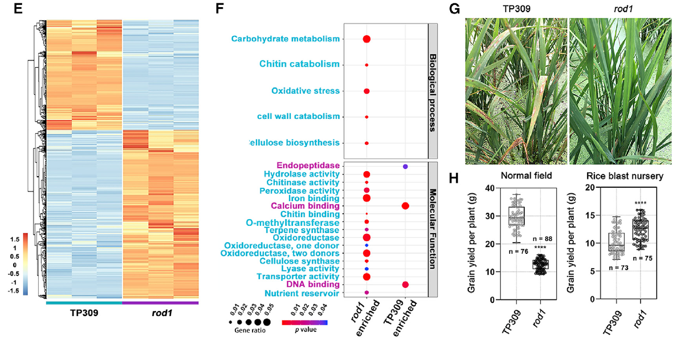
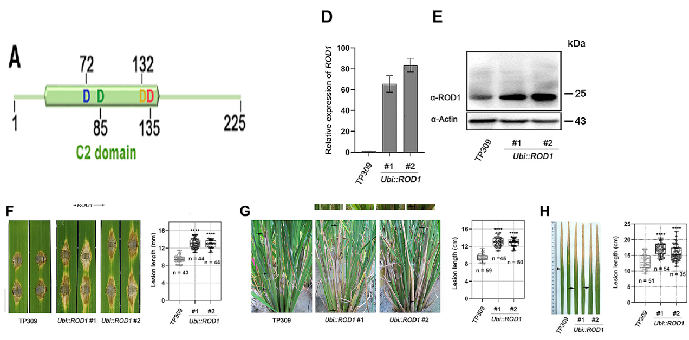
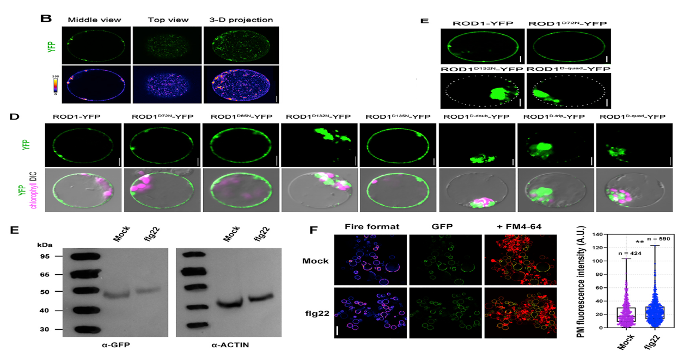
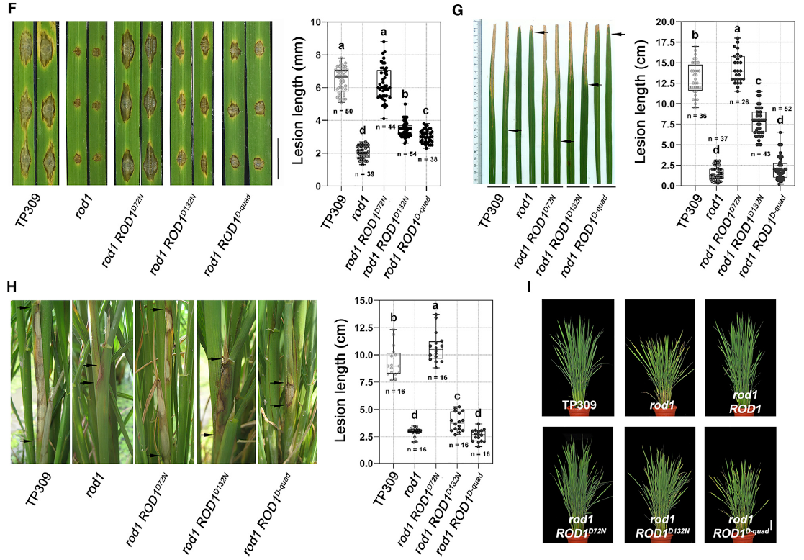
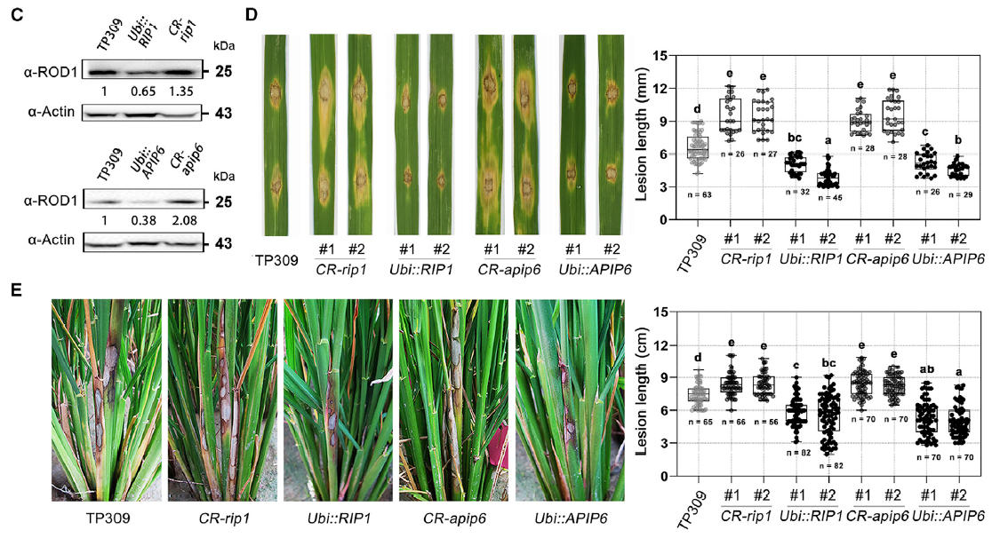
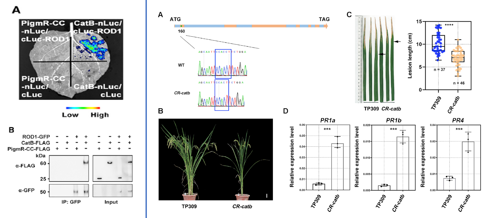
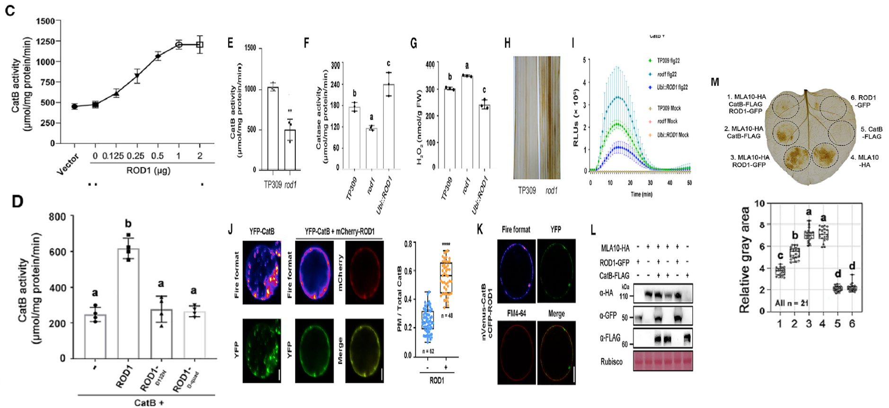
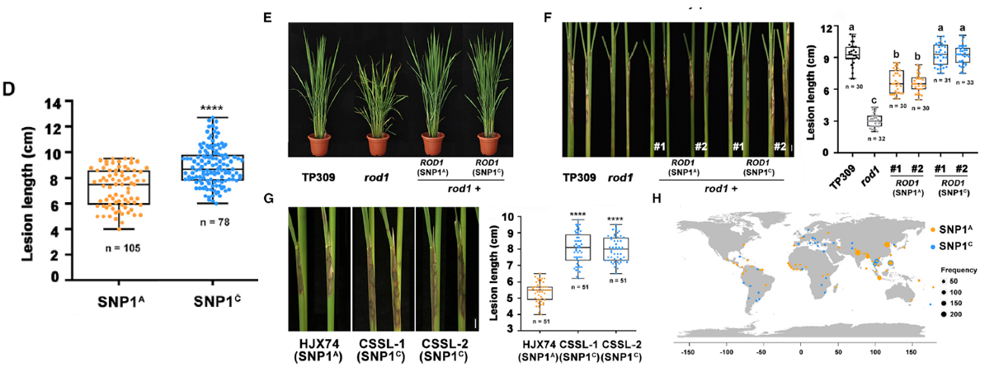
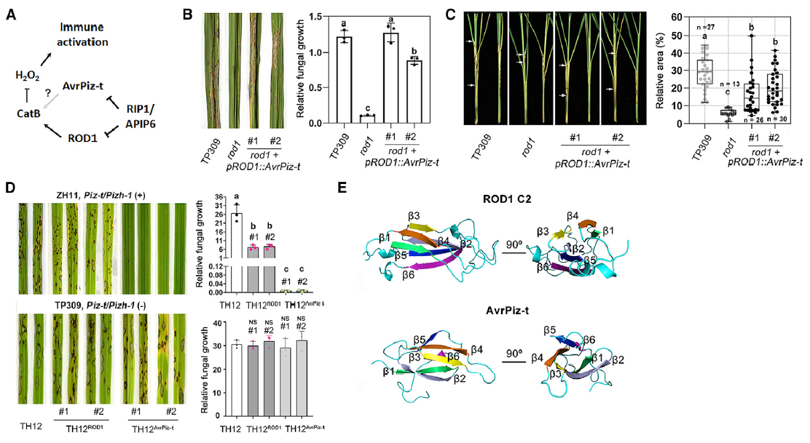

# 嗑盐文献 {#literature}

## 本章前言

本章主要与文献阅读相关。

## 何祖华2021*Cell*文章

这是一篇让人读完以后叹为观止的文章[@gao2021ca2:Cell]，精彩，实在是精彩！

故事是这样开始的，在TP309（粳稻）育种群体中，发现一个很特殊的变种，这个变种携带了一个叫做*`rod1`*的基因，这个基因有什么特别的地方呢？通过田间试验和室内试验发现，携带了*`rod1`*基因的植株对水稻纹枯病、水稻稻瘟病和水稻白叶枯病这三种严重影响水稻生产的病害都具有广谱抗性（下图ABC）；而且，其植株体内的SA和JA的含量也比TP309的高很多（下图D）。

为了验证*`rod1`*的广谱抗性，利用常规的RNA-Seq对TP309和携带*`rod1`*的植株进行转录组测序，测序的结果可以说是非常明显了，但从热图上看是完全分开的（下图E），然后呢对这些差异基因进行GO富集分析，发现有几个很特殊的GO term在*`rod1`*里面没有，这几个通路分别是内肽酶、钙结合及DNA结合（下图F紫色的字）。*`rod1`*中显著富集到的GO term有离子结合、氧化酶等。于是，作者他们认为*`rod1`*中Ca$^{2+}$与ROS两者之间存在某种关系，导致其免疫上调。然后在田间观察TP309和*`rod1`*对水稻产量的影响，发现在自然田间条件下的话，*`rod1`*植株的单株产量远低于TP309的；但是在天然的稻瘟病苗圃中，*`rod1`*的单株产量远高于TP309。这个结果能说明啥呢？这个结果说明如果有病害侵染的话，*`rod1`*植株会表现得更好，也就是产量更高。

下一步要做的，肯定是把这个基因克隆出来，只有克隆出来，才能做进一步的深入研究。利用图位克隆技术在水稻的6号染色体附近大概53kb的一个区域定位到该基因（下图A），命名为*`ROD1`*；进一步比较了水稻参考基因组水稻品种Nippionbare、TP309及*`rod1`*在该区域的序列差异，发现*`rod1`*存在一个核苷酸的缺失，也就是TP309里面的是`ATGGG`，在*`rod1`*里面是`AT-GG`，中间少了个`G`（下图B）。为了确定他们鉴定的这个基因，利用遗传互补（也就是利用野生型基因补偿突变型基因使其恢复正常的表型）确认了该基因的功能（下图C）。

这个基因的蛋白长度大概是225个氨基酸长度，并且含有一个C2结构域（蛋白质激酶C保守结构域2，承担信号转导和细胞膜转运功能），这个结构域上还含有4个天冬氨酸残基（下图A）。然后利用玉米泛素启动子将*`ROD1`*过表达，过表达以后呢制作对水稻上的三种病害的抗性都降低了（下图DEFGH）。这个结果说明*`ROD1`*是水稻免疫抑制子，也就是它越表达，水稻的抗性越低。

不同的基因在植株体内表达的位点是不一样的，有的基因在根系表达多，有的基因在叶片中表达更旺盛。那*`ROD1`*主要是水稻植株的那个部位表达呢？通过原位杂交（*`In situ hybridization`*），发现*`ROD1`* 主要是在叶片上进行表达（下图B），而叶片更好是更多病原菌侵染的部位。而且在水稻植株被水稻白叶枯病菌侵染后，*`ROD1`* 的表达会被诱导上调（下图C）。*`rod1`*在田间生长的时候穗子比TP309短，穗子上的分支也更少（下图K），但是在过表达*`ROD1`* 后，穗子更长，产量也更高（下图KL）。这个结果表明`ROD1`在水稻的抗性和生长适应性两方面具有不同的作用。也就是*`rod1`*的抗性高，但是产量低；*`ROD1`* 的抗性低，但是产量高。这也符合植物生长-免疫平衡的基本原则。

再下一步是探究`ROD1`的同系物的分布情况，在开花植物中都有其同系物的存在，但是在苔藓等低等植物中没有其同系物的踪迹（下图AB）。这个结果表明ROD1这一类C2结构域蛋白出现在植物进化的较晚期。ROD1类蛋白在单子叶作物中有着极高的序列保守性，但是在拟南芥等十字花科的植物中却有着较高的多样性（下图B）。要是我分析，肯定是到这里就结束了，但是作者团队在这个地方提出的问题是“ROD1类蛋白在谷物类作物的免疫过程中是否有保守作用呢？”。于是呢，就用CRISPR/Cas9技术在玉米上搞了个突变体，结果发现突变体中*`PR`*基因的表达量更高，而且突变体对*R.solani* 的抗性更强（下图CDE）。这个结果加上前面的结果表明*`ROD1`*及其同系物在谷物中是一类特别的感病基因，在谷物免疫的过程中扮演者保守的功能。

前面提到*`ROD1`*蛋白结构含有1个C2结构域，那这个有什么用呢？C2结构域通常是Ca$^{2+}$感受器，这类结构域依赖Ca$^{2+}$与磷脂结合，从而将蛋白质靶向到特定的膜区域。那ROD1这个蛋白到底能不能和Ca$^{2+}$结合呢？能不能结合那肯定是要有个参照，怎么获得有效的参照呢？对这个蛋白的4个氨基酸残基进（因为C2结构域的氨基酸残基影响其和Ca$^{2+}$的结合）行突变，有单突变、双重突变、三重突变及四重突变（下图C）。利用微量热泳动方法来探究ROD1这个蛋白和Ca$^{2+}$的结合特性（下图D），图中的KD值的大小表示的是分子间的亲和性，越亲和的，其KD值越小。没有突变的ROD1和Ca$^{2+}$的KD值很小，而单位点突变和四重突变的KD值都很大，整整大了3个数量级。Ca$^{2+}$能够改变C2结构域的电位，使得C2结构与能够与磷脂进行结合。那下一步就是探究ROD1与不同脂质结合的能力与特异性（下图A）。从图中可以看到的是，ROD和PI(3,5)P2、PI(4)P及PI(5)P结合较好，但是Ca$^{2+}$螯合剂EGTA存在的时候，ROD1就不能与这些脂质进行结合。也就是说当没有Ca$^{2+}$的时候，ROD1是不能与磷脂进行结合的。

ROD1这个蛋白在哪里发挥功能呢？这也就需要对其进行定位。通过定位发现这个蛋白位于质膜周围的细胞外围空间（下图B）。但是将其4个氨基酸残基进行突变后都不同程度地出现了蛋白的降解（下图DE$_上$）。用`flg22`处理后，ROD1在质膜上的积累量更多（下图EF），这说明免疫激活促进了ROD1在质膜上的分布。

除了利用突变体看突变氨基酸残基后蛋白的定位，还检测突变不同的氨基酸位点后其抗性的变化，也就是过表达这些基因，不同程度的突变都导致对应植株的抗性降低，对三种病害的响应出奇一致（下图FGH）。不同位点的突变对植株的构型也有一定的影响（下图I）。

上述这些结果表明ROD1和Ca$^{2+}$结合后，进一步与磷脂结合，最后在质膜上“定居”。其实在这个部分已经能够看出，要是没有Ca$^{2+}$，那ROD1就“手足无措”了。

有了材料，有了表型，克隆到了基因，纯化到了蛋白，也知道这个基因能够影响植株的免疫，那下一步就是探究其免疫的机制。利用的方法是酵母双杂（Y2H）。首先是  以水稻稻瘟病互作的叶片建立一个cDNA文库，然后以ROD1为“鱼饵”去钓这个文库中与ROD1互作的蛋白。成功得到两个RING E3泛素连接酶，分别是RIP1和APIP6（下图）。进行更多试验后发现ROD1被RIP1和APIP6这两个蛋白泛素化（泛素化就是某个蛋白被加上一段标签，被加上标签的蛋白会被其他的细胞器所识别，大多被泛素化的蛋白的最终命运是降解）。

为了进一步验证RIP1和APIP6的功能，分别构建了敲除系和过表达系。果然不出意外，敲除系的植株的抗性都降低了，而过表达系植株的抗性都提高了。怎么理解呢？将这两个蛋白敲除后，ROD1就不能被泛素化，那它就不会降解，表达量较高，因此植株的抗性被抑制；将这两个蛋白过表达后，含量增加，ROD1被“疯狂”泛素化，也就是被疯狂降解，那植株的免疫就不会受到抑制，从而表现出较强的抗性。

除了RIP1和APIP6以外，酵母双杂还找到一个和ROD1互作的过氧化氢酶CatB。通过分裂荧光素酶互补试验和coIP发现ROD1和CatB是能够互作的（下图左AB）。过氧化氢酶能够清除ROS从而降低寄主的免疫水平。用CRISPR/Cas9将CatB敲除后，水稻植株体内*`PR`*基因的表达上调，植株对病害的抗性增强（下图右ABCD）。这说明CatB负向调控水稻对病害的免疫响应。

那ROD1和CatB是如何互作的呢？先用不同浓度的ROD1和CatB共同清除活性氧，可以发现的随着ROD1浓度的提高，CatB的活性增强，也就是说ROD1浓度越高，那CatB清楚的活性氧也就越多（下图C）；但是将基因*`ROD1`*进行突变后，蛋白ROD1介导的CatB清除活性氧的能力没有变化（下图D），也就是ROD1只有和Ca$^{2+}$结合后才能正常和CatB互作，从而清除ROS。怎么理解呢？前面说到，如果突变*`ROD1`*C1结构域上的4个氨基酸残基，那ROD1和Ca$^{2+}$结合的能力就降低了，没有Ca$^{2+}$结合，ROD1就不能正常介导CatB对ROS的清除。进一步提取活体植株体内的ROD1，发现TP309中CatB的活性都更搞（下图EF）。与之对应的是，TP309植株中H$_2$O$_2$的含量更低（下图GHI）。这些结果说明了啥呢？说明ROD1是通过介导ROS的清除来影响植株的免疫的。CatB这个蛋白主要定位在过氧化物酶体上，但是呢在质膜上也检测到了CatB的存在，当有ROD1存在的时候CatB在质膜上积累的量更多（下图JL），这样就说明了ROD1促进CatB在质膜上的定位。进一步利用本氏烟验证发现CatB能够在一定程度上清除由MLA10介导的过敏反应，当ROD1和CatB共同作用的时候这种过敏反应几乎完全消失了。上面这些结果表明ROD1首先将CatB募集到质膜能赶上，然后再激发CatB去清除活性氧。

找到这样一个基因，做完上述这些研究，其实已经很完美了。作者他们进一步探究这个基因在水稻群体中的变异情况。通过群体遗传分析发现*ROD1*这个位点上的核苷酸多态性很低，也就意味着这个位点在进化过程中发生了选择扫描事件（下图左A）。在约3000个水稻品种中，只有*indica* 这个亚种的`Tajima’s D`值是负值，也就意味着在*indica* 这个亚种中*ROD1*经历了不同的选择作用（下图B）。在这个基因的编码区发现了两个SNP，分别是SNP1$^{A/C}$和SNP2$^{G/C}$。第一个SNP是一个非同义的突变，在这个位点上脯氨酸变成了苏氨酸；第二个SNP是一个同义突变，编码的氨基酸没有发生改变。基于这两种SNP分类，可以将其分为三种单倍型（下图右A）。

随机选了178个含有这三种单倍型的水稻品种，调查其在田间对纹枯病的抗性（因为纹枯病还没有主效抗病基因），发现含有SNP1$^{A/C}$的水稻品种对纹枯病的抗性更强（下图D）。将这两种SNP导入到*rod1*中后发现SNP1$^{C}$的抗性基本和TP309持平，SNP1$^{A}$植株的抗性比*rod1*的弱一些（下图F），这个结果再次表明SNP1$^{A/C}$确实影响植株的基础免疫。为了进一步验证SNP1$^{A}$和SNP1$^{C}$的功能差异，他们构建了染色体片段替换系，发现携带SNP1$^{C}$的植株的抗性更弱（下图G），也就意味着携带SNP1$^{A}$的抗性更强，但是在产量上是没有差异的。进一步探究发现这两种单倍型对CatB的影响也不一样，SNP1$^{C}$对CatB的影响更大，也就意味着*ROD1*上单核苷酸的变异影响其与CatB的互作。为了探明SNP1$^{A/C}$的进化差异，比较了44个野生稻中*ROD1*的序列差异，发现只有4个野生稻携带了SNP1$^{C}$，剩下的40个都携带的是SNP1$^{C}$。SNP1$^{A}$主要存在于籼稻中，而SNP1$^{C}$主要存在于野生稻和粳稻中，而籼稻主要分布在热带和亚热带，而粳稻主要分布在温带，也就是说SNP1$^{C}$和SNP1$^{C}$的分布是有明显的分布差异的（下图H）。总之，这些结果表明*ROD1*等位基因的变化导致其清除ROS的能力有差异，也就导致了品种特异性的抗性差异。

之前鉴定到的与ROD1互作的蛋白APIP6有报道它能够和稻瘟病菌的效应子AvrPiz-t互作并将其降解，RIP1和APIP6高度相似，那RIP1能不能与AvrPiz-t互作呢？通过一波试验发现这两个蛋白确实能够互作。也就是说ROD1与AvrPiz-t都与RIP1和APIP6互作，而且ROD1和AvrPiz-t都能抑制寄主免疫，那AvrPiz-t抑制寄主免疫的机制是不是和ROD1一样呢？一波试验过后发现AvrPiz-t和ROD1一样，与同样的E3泛素连接酶互作，参与同样的降解通路，同样促进了过氧化物酶介导的ROS清除来抑制寄主植物的免疫。利用ROD1的启动子在*rod1*中过表达AvrPiz-t，发现过表达后，*rod1*原先的抗性基本全部丧失（下图BC）。然后呢利用两个不同的水稻品种ZH11和TP309进行进一步验证，其中ZH11含有AvrPiz-t的抗性基因，而TP309没有这个对应的基因，两个水稻品种都接种稻瘟病菌TH12（没有效应子*AvrPiz-t*）。发现ROD1能够在一定程度上恢复TH12的致病力（下图D）。再比较ROD1和AvrPiz-t的蛋白结构后发现这两个蛋白的结构极其相似，也就意味着它们有着一样的的免疫抑制机制。

