# R语言开发 {#r-deve}

### 一些资源

- [Building R packages with devtools and usethis | RStudio](https://colorado.rstudio.com/rsc/pkg-building/#1)
- [Using RMarkdown to Create Reproducible Documents (Oct 26, 2021) Presenter: Mine Çetinkaya-Rundel](https://www.youtube.com/watch?v=z2a80FnLFfE&t=7s)

## 一些Tips

- 将数据框作为提示信息进行输出：


```r
design.demo = data.frame(N = 1:12,
                        Treatment = rep(c("CK", "T1", "T2"),each  =4),
                        Gene = rep(c("gene1", "gene2", "gene3", "gene4"), 3))

stop(paste(c("Design matrix should be input! Like...",
             capture.output(print(design.demo, row.names = FALSE))),
           collapse = "\n"))
```

- Linux指定R镜像，加速下载安装：


```r
options (repos=structure (c (CRAN="https://mirrors.tuna.tsinghua.edu.cn/CRAN/")))
options (BioC_mirror="https://mirrors.tuna.tsinghua.edu.cn/bioconductor")
```


## R包pac4xiang的使用  {#pac4xiang}

`pac4xiang`这个R包是我自己开发的，包含了一些我自己常用的函数。包目前在[GitHub](https://github.com/lixiang117423/pac4xiang)上，更多功能还在完善中，待进一步开发。

### 安装

在R中运行下面的代码安装`pac4xiang`。


```r
devtools::install_github('https://github.com/lixiang117423/pac4xiang')
```

### 使用方法

#### `calStandCurve`

该函数用与计算相对定量qPCR的标曲。qPCR标曲点样参照图\@ref(fig:qPCR1)。按照我的思路和习惯，我会准备8个浓度梯度的cDNA,从高到低分别是C0到C8。C0是对应批次下多有样品cDNA的组合，然后再以一定的稀释倍数稀释得到C1，C1再以同样的倍数稀释得到C2，依此类推，直到得到C8。

<div class="figure" style="text-align: center">
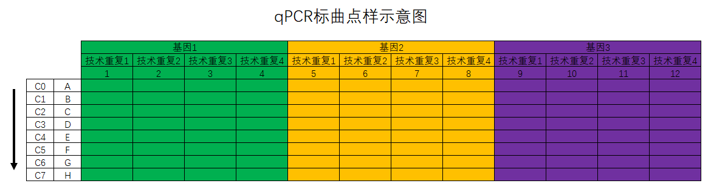
<p class="caption">(\#fig:qPCR1)qPCR标曲点样示意图</p>
</div>

函数具体怎么用呢？参考下方的代码：


```r
df.1 <- calStandCurve(
  data = "20210927下机数据/20210928lx_1.txt",
  genes = c("OsPOX223", "OsAPX1", "OsAPX2", "OsPAL"),
  rep = 3,
  dilution = 4,
  start = 2,
  end = 6,
  drop.NA = TRUE,
  fig.type = "pdf"
)
```

其中基因的数量和技术重复的数量乘起来必须是12；基因的顺序必须是从左到右的；输入稀释倍数后告诉程序后续的标曲建立如何取相应的对数；`start`表示从第几行开始计算，如`start = 2`表示的是从B行开始计算标曲；对应的`end = 6`表示的是到第6行，也就是F行结束，也就意味着第一行和最后两行其实是不用的。默认是保存标曲的图片的，如果不需要保存图片加上`save.fig = FALSE`即可，默认的图片格式是`pdf`格式，可以自定义。

<div class="figure" style="text-align: center">
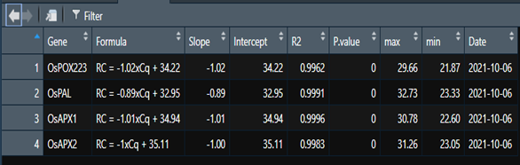
<p class="caption">(\#fig:qPCR2)函数calStandCurve返回的数据框</p>
</div>

返回的结果是个数据框（参考图\@ref(fig:qPCR2)），包含了基因名称、标曲公式、斜率、截距、R$^2$、P值、该标曲适用的自变量范围（最大值和最小值）及计算标曲的日期等。保存的图片默认存在当前工作目录下（运行`getcwd()`查看当前R语言工作目录）。

#### `calRTqPCR`

该函数在`calStandCurve`函数返回的标曲结果的基础上可以计算不同处理下各基因的表达情况。样品的点样方法参考图\@ref(fig:qPCR3)。

<div class="figure" style="text-align: center">
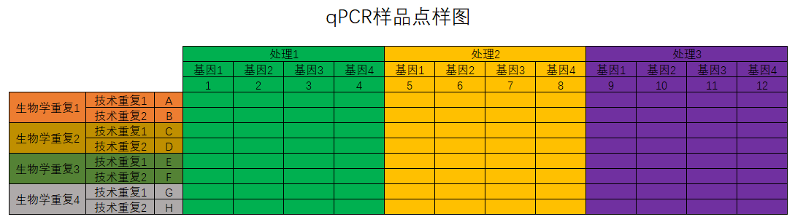
<p class="caption">(\#fig:qPCR3)qPCR标曲点样示意图</p>
</div>

计算表达量的代码如下：


```r
exp.1 <- calRTqPCR(
  data = "20210927下机数据/20210929lx_1.txt",
  StandCurve = df.1,
  genes = c("OsPOX223", "OsAPX1", "OsAPX2", "OsPAL"),
  treatment = c("CK", "Inter", "Infect")
)
```

  其中的`data`就的样品的下机导出数据，`StandCurve`是函数`calStandCurve`返回的数据框，`gene`需要严格控制大小写，必须和输入函数`calStandCurve`的基因名称一样，`treatment`是指定从左到右的处理分别是什么，这个是为了后续方便进行*`t`*检验。

#### `getAlignResults`

该函数可以将软件`CLUSTALW`的输出文件变成`.fasta`格式的比对结果。
写这个函数的原因在于每次我用MEGA进行序列比对构建进化树的时候都报错，不是字符串有问题就是长度不对，索性直接用Linux系统下的`CLUSTALW`进行序列比对，然后用MEGA构建进化树，百试不爽！


```r
my.aln = getAlignResults(aln = 'test.aln')
```

  运行完成后会在当前目录下生成一个`YourAlignResults.fasta`文件，就是`fasta`格式的比对文件，然后就可以用来构建进化树了。

- `mult.aov`
  该函数用于多分组数据进行方差分析。

- `multGroupTtest`
  该函数用于进行多分组的`t`检验。
  这个函数是用于进行多组`t`检验的。比如每次跑qPCR，会有多个处理多个目的基因，这个时候就需要关注每个目的基因在不同的处理中的表达量。用法参考下方代码：


```r
t.test <- multGroupTtest(
  data = exp.all.final,
  group1 = "Gene",
  group2 = "Treatment",
  CK = "CK",
  value = "Expression",
  level = 0.95
)
```

#### `plot96well`

该函数用于可视化`Roche`96孔板的`Cq`值。


```r
plot96well(data = "20210927下机数据/20210928lx_1.txt")
```

#### `plotCisElement`

该函数用与可视化基因启动子上的顺式作用元件。需要输入的参数有三个：

#### `data`：`plantCARE`返回的文件；

#### `length`：启动子长度；

#### `Cis`：需要展示哪些顺式作用元件。

#### `plotGeneStructure`

该函数用于可视化基因结构。输入文件为`.gtf`文件。
如果同时输入对应的进化树文件，那么就会按照进化树的顺序对基因名称进行排序，可以和`ggtree`进行联用。

#### `fasta2df`

这个函数主要是为了将`fasta`格式转换成R中常见的`data.frame`格式。使用很简单，输入`fasta`格式即可。

#### `df2fasta`

这个函数主要是将`data.frame`格式的序列文件转换成`fasta`格式。

## R包ggmotif的使用方法 {#ggmotif}

激发我开发这个R包的原因是在许做基因家族分析中的`motif`分析的时候总是找不到趁手的工具去可视化相关的结果，要么是在线网站，要么是别人开发的工具，网页版工具怕哪天就跑路了，别人的工具想要个性化比较困难。那，就自己写一个吧。

R包下载安装：


```r
install.packages("ggmotif")

# 或者
devtools::install_github("lixiang117423/ggmotif")
```

`meme`输出的结果主要是`XML`格式和`txt`格式的文件，需要的结果就在这两个文件里面。

### 从XML文件提取结果并绘图

`motif`在序列上的位置结果存放在`XML`格式的文件中，运行下面的代码便可以将结果转换成数据框格式并进行可视化。


```r
filepath <- system.file("examples", "meme.xml", package="ggmotif")
motif_extract <- getMotifFromXML(XMLfile = filepath)
motif_plot <- motif_location(data = motif_extract)
motif_plot
```

### 从txt文件提取结果并进行可视化

每个`motif`的序列是存放在`txt`文件中的，运行下方的代码便能结果转换成数据框格式并进行绘图。


```r
library(tidyverse)

filepath <- system.file("examples", "meme.txt", package = "ggmotif")
motif_extract <- getMotifFromTxt(data = filepath)

motif_extract %>% 
  dplyr::filter(motif.num == 'Motif.1') %>% 
  dplyr::select(input.seq.motif) %>% 
  ggseqlogo::ggseqlogo() +
  theme_classic()
```

### 与`ggtree`联用

有时候会对序列构建进化树展示进化关系，`ggmotif`中的函数能够以输入的进化树文件为基础，把输出的`motif`在序列上的位置与进化树上的位置进行匹配，便能够与`ggtree`联用在一个图上展示进化树和`motif`在序列上的位置。


```r
filepath <- system.file("examples", "meme.xml", package="ggmotif")
treepath <- system.file("examples", "tree.nwk", package="ggmotif")
motif_extract <- getMotifFromXML(XMLfile = filepath)
motif_plot_with_tree <- motif_with_tree(data = motif_extract, tree = treepath)

p.tree = ape::read.tree(treepath) %>% 
  ggtree::ggtree() +
  ggtree::geom_tiplab()

p.tree  %>% 
  aplot::insert_right(motif_plot_with_tree, width = 0.8)
```

## R shiny开发

### CSS学习网站

[CSS菜鸟教程](https://www.runoob.com/css/css-align.html)。

[CSS在Rshiny中的使用](https://unleash-shiny.rinterface.com/beautify-css.html)。

### 服务器搭建Rshiny-server


```r
#root 权限进入
sudo su
useradd shiny # 添加shiny用户
passwd shiny # 修改shiny用户的密码

chmod +w /etc/sudoers # 修改权限
sudo vim /etc/sudoers # 编辑
# root ALL=(ALL) ALL 该行，在下面添加 shiny ALL=(ALL:ALL) ALL
chmod -w /etc/sudoers # 收回权限

su - shiny # 切换到shiny用户

# 安装R
sudo apt-get update
sudo apt-get install r-base

# 安装shiny包
sudo su -c "R -e \"install.packages('shiny',repos='https://cran.rstudio.com/')\""

# 安装shiny server
sudo apt-get install gdebi-core
wget https://download3.rstudio.org/ubuntu-14.04/x86_64/shiny-server-1.5.17.973-amd64.deb
sudo gdebi shiny-server-1.5.17.973-amd64.deb
```

安装shiny-server的时候参考官方最新的指导页面，[点击访问](https://www.rstudio.com/products/shiny/download-server/ubuntu/)。

日志所在目录为：`/var/log/shiny-server`。需要修改配置文件，保证记录运行日志，否则可能找不到报错提示。


```r
vi /etc/shiny-server/shiny-server.conf
preserve_logs true; # 在最上面添加这行
```

软件所在目录为：`/srv/shiny-server`

安装完成后在浏览器输入`IP:3838`就能访问到示例界面了。默认的端口是`3838`端口，需要其他端口的需要自行调整。

基本管理：


```r
## 重启
sudo systemctl restart shiny-server
##查看状态 
sudo systemctl status shiny-server 
##开启 
sudo systemctl start shiny-server 
##停止 
sudo systemctl stop shiny-server 
```

### Ubuntu安装devtools


```r
sudo apt-get install -y libxml2-dev libcurl4-openssl-dev libssl-devv
```

最重要的是上面这一步，剩下的差啥装啥就OK。

安装`proj`这个包：


```r
sudo apt-get install libproj-dev

install.packages("RcppEigen", INSTALL_opts = '--no-lock')
```

按照依赖库：


```r
wget ftp://xmlsoft.org/libxml2/libxml2-2.9.2.tar.gz
tar -xvf libxml2-2.9.2.tar.gz
cd libxml2-2.9.2
./configure --prefix=/usr --disable-static --with-history && make
sudo make install
```

### 上传文件大小限制


```r
options(shiny.maxRequestSize=1000*1024^2)
```

## 美化RShiny

### htmltools包的使用


```r
library(htmltools)
tag <- div("Hello World")
tag
```

查看HTML下的所有tags：


```r
htmltools::tags$
```

在R里面使用tags的两种方法：


```r
# good
h1("This is a title")

# correct but not necessary
tags$h1("This is a title")
```

含有大量tags时候的写法：


```r
# Better
withTags(
  nav(div(), ul(li(), li()))
)

# instead of 
tags$nav(div(), tags$ul(tags$li(), tags$li()))

# good
tag_list_1 <- tagList(
  p("Some text"),
  div("Content")
)

str(tag_list_1)
```

如何定义新的tag：


```r
customTag <- tag(
  "test", 
  list(class = "test", p("Custom Tag"))
)
str(customTag)
```

将HTML代码转换成R代码：https://github.com/alandipert/html2r

如何玩转R里面的tag：


```r
# create the tag
myTag <- div(
  class = "divclass", 
  id = "first",
  h1("My first child!"),
  span(class = "child", id = "baby", "Crying")
)
# access its name
# myTag$name
# access its attributes (id and class)
# myTag$attribs
# access children (returns a list of 2 elements)
# myTag$children
# access its class
str(myTag)
```

如何修改子tag的class：


```r
myTag$children[[2]]$attribs$class <- "adult"
myTag
```

管理CSS的三种方式：

- **External** CSS file `tags$link(rel = "stylesheet", type="text/css", href="www/style.css")`.
- **Internal** CSS `tags$head(tags$style("p {color: red;}"))`.
- **Inline** CSS `p(style = "color:red;", "Red text")`.

CSS选择器：


```r
selector {
  property: value;
}

# 如
p {
  color: red;  
}
```

多个选择器：


```r
p, div {
  color: red;  
}

# 如
ui <- fluidPage(
  tags$style(
    "p, div {
      color: red;
    }"
  ),
  p("Hello World"),
  div("A block")
)
```

通过class和id进行选择：


```r
.first-p {
  color: red;  
}

#element {
  color: red;
}

ui <- fluidPage(
  tags$style(
    ".first-p {
      color: red;
    }
    #element {
      color: red;
    }
    "
  ),
  p(class = "first-p", "Hello World"),
  p("Another text"),
  div(id = "element", "A block")
)
```

如何改变某个字的属性呢？


```r
<p>Hello <span class="custom">World</span>! What's up?</p>
.custom {
  color: red;
}
```

class一致的时候怎么选择：先选择tag


```r
<li class="nav-item">
  <a class="nav-link" href="#">Link</a>
</li>

<a class="nav-link" href="#">Link</a>

li a {
  color: red;
}
```


```r
### RUN ### 
# OSUICode::run_example( 
#  "css/selector-nested/ex1", 
#   package = "OSUICode" 
# ) 

### APP CODE ### 
library(shiny)

ui <- navbarPage(
  "App Title",
  tabPanel(
    "Plot",
    tags$style(
      "li a {
        font-size: 20px;
        font-weight: bold;
      }
    "
    ),
    tabsetPanel(
      tabPanel("Plot"),
      tabPanel("Summary"),
      tabPanel("Table")
    )
  ),
  tabPanel("Summary"),
  tabPanel("Table")
)

server <- function(input, output) {}

shinyApp(ui, server)
```

## golem包开发产品级Shiny

golem的内核思想是`每个Rshiny应用都应该是个R包`。

### 什么是产品级的shiny app

- 有metadata

app的名字、版本、功能、报错时的联系信息等。这个部分的内容相当于R包里面的`DESCRIPTIONM`。

- 没有依赖关系上的报错

把整个shiny app中需要用到的包写成R包里面的`DESCRIPTIONM`格式，把需要用到的函数写成R包里面的`NAMESPACE`文件。这样就能避免各种各样的报错。

- 整个app划分成不同的function模块

避免将app的左右函数都写在一个文档里面，那就将这些function分开写，并像R包那样放在`R`整个文件夹内。

- 有文档手册
  - `README`文件：放在根目录下，说明如何安装这个app以及如何使用这个app。
  - `Vignettes`：一个比`README`文件更长的文档，从细节上说明如何使用这个app。
  - 函数文档：和写R包一样，app里面的每个函数都应该有对应的文档。
- 测试运行。

**Nothing should go to production without being tested. Nothing.**

把shiny app写成R包的构造方便进行测试，不如用`testthat`进行测试。

## 如何在模块间传递数据

- 通过reactive返回数据
- [reactiveValues()](https://shiny.rstudio.com/reference/shiny/latest/reactiveValues.html)构造全局变量
- 创造R6对象进行传递。

### golem结构

golem的底层概念就是每个shiny app都是个R包。

创建golem对象：


```r
golem::create_golem("shiny4RefPlantNLR")
```

查看结构：


```r
fs::dir_tree("shiny4RefPlantNLR")
```


```r
shiny4RefPlantNLR
+-- DESCRIPTION 
+-- dev
|   +-- 01_start.R
|   +-- 02_dev.R
|   +-- 03_deploy.R
|   \-- run_dev.R
+-- inst
|   +-- app
|   |   \-- www
|   |       \-- favicon.ico
|   \-- golem-config.yml
+-- man
|   \-- run_app.Rd
+-- NAMESPACE
+-- R
|   +-- app_config.R
|   +-- app_server.R
|   +-- app_ui.R
|   \-- run_app.R
\-- shiny4RefPlantNLR.Rproj
```

- DESCRIPTION

含有各种metadata,比如谁写的app，版本，app目的是啥，报错应该联系谁等等。这个文件是由`dev/01_start.R`这个函数自动生成的。

- NAMESPACE

这个文件是绝对不能手动编辑的！！！包含的信息有：哪个包的哪个函数被导入，哪个功能被export。如何产生这个文件呢：


```r
devtools::document()
## OR
golem::document_and_reload()
```

- *R*文件夹

用于存放核心函数。其实只要是`.R`结尾的文件都应该放在这个文件夹里面。那为什么在`dev/`这个文件夹下面还有`.R`结尾的文件呢？虽然是`.R`结尾的文件，但是他们并不是核心函数吗，只是开发过程中需要用到的信息。

特别需要注意的是这个文件夹下面不能有任何子文件夹！！！

## 网页工具shiny4qPCR使用说明

工具地址：http://106.55.94.9:3838/shiny4qPCR/

### 反转录计算
反转录使用的试剂盒为全式金的TransScript® All-in-One First-Strand cDNA Synthesis SuperMix for qPCR(One-Step gDNA Removal)。其反转录步骤为：
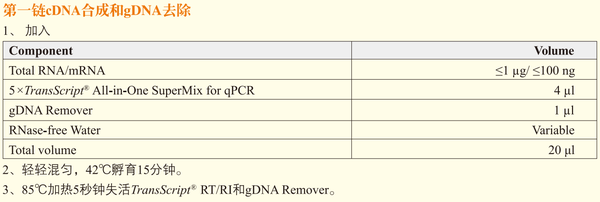

在进行计算是只需要上传Nano Drop2000的下机数据，再选择需要反转的体积即可。计算完成后返回的数据是求均值后的数据，即对每个样品求均值，然后继续计算，组后返回结果。
Nano Drop2000的下机数据样式点击下载示例数据即可。

### 标曲计算
标曲计算需要一个Excel文件，找个Excel文件中需要有三个sheet，三个sheet的数据分别是：
- Roche qPCR仪器下机数据；
- 基因布局图：告诉程序每个孔里面的基因叫什么名字；
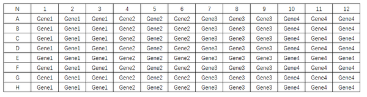

- 浓度布局图：告诉程序每个孔里面的物质的相对浓度是多少。

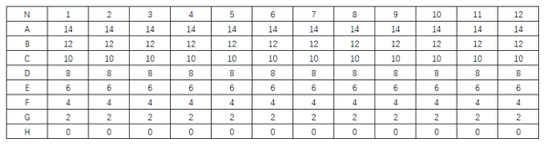

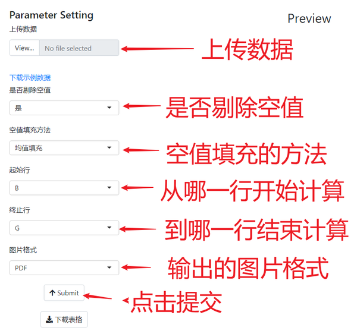
需要注意的地方：
- 空值填充时是用同一基因同一浓度下的均值进行填充。

### 计算表达量（标曲法）
用标曲法计算表达量时，也只需要上传一个文件即可（下载示例数据查看样式）。四个文件分别为：
- qPCR下机数据；
- 处理布局图：告诉程序每个孔分别属于什么处理；

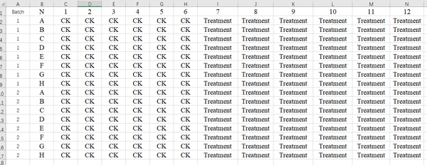

- 基因布局图：告诉程序每个孔分别是什么基因（基因名称严格区分大小写）；

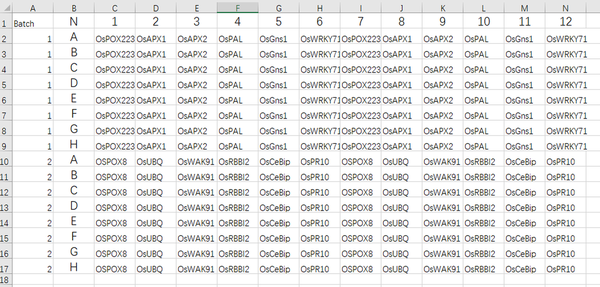

- 基因标曲信息：前面输出的标曲信息。

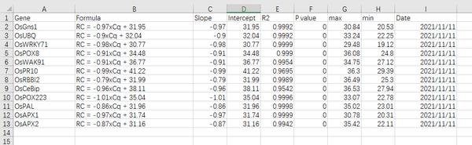

需要注意的地方：
- 基因名称严格区分大小写；
- **前三个表格的第一列必须是Batch**，也就是告诉成程序你的数据属于第几批次，当有多次下机数据的时候，将多次下机数据合并在一个文件进行上传计算会方便很多。
- 程序默认使用内参基因对表达量进行校正，可以选择不校正。如果选择用内参基因进行校正，那就需要输入内参基因名称，必须严格区分大小写。

### 计算表达量（2$^{-\delta{\delta}C_t}$法）

使用2$^{-\delta{\delta}C_t}$法计算表达量的输入数据和使用标曲法输入数据是一致的，唯一的差别在于使用2$^{-\delta{\delta}C_t}$法不需要标曲数据，前三个表是一样的。

### 差异表达统计

差异表达统计需要输入一个数据，也就是前面计算完表达量以后的数据文件。关键的有三列：
- Treatment：是什么处理
- Gene：是哪个基因
- Expression：对应的表达量

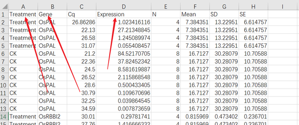

程序默认使用t-test进行统计检验，当有多个处理时可以选择Anova。统计检验水培默认的是0.95，可以选择0.99。
得到的结果只算统计分析的结果，没有包含原始数据。


